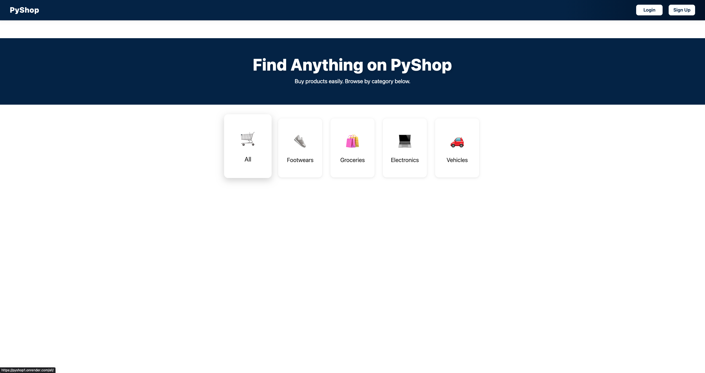
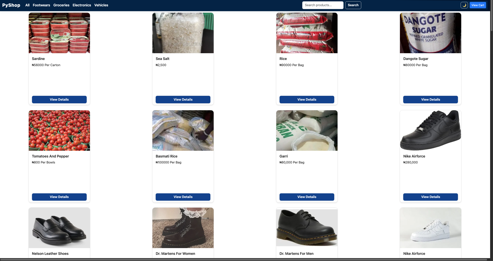
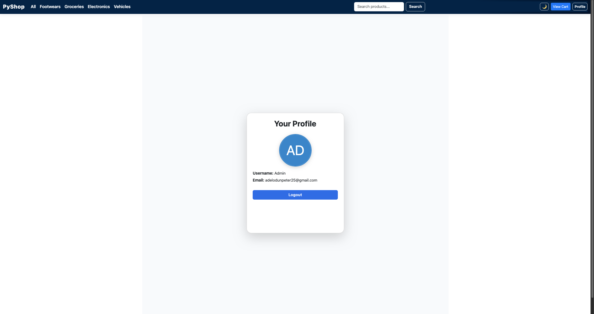
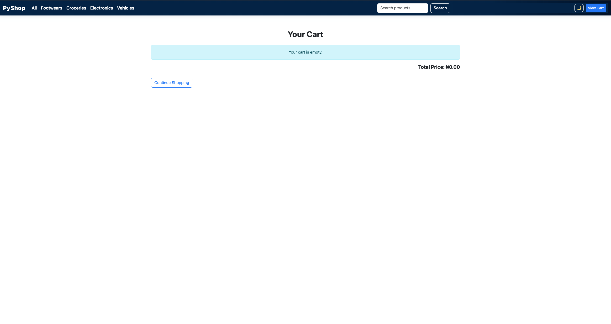

# 🛍️ PyShop – Django E-commerce Website

PyShop is a modern, responsive e-commerce website built with Python and Django. It features a clean UI (with dark mode!), user authentication, product listings by category, admin tools, a responsive cart and more.

<p align="center">
  
  
  
</p>

---

## 📚 Table of Contents

* [🚀 Features](#-features)
* [🛠️ Tech Stack](#️-tech-stack)
* [📸 Screenshots](#-screenshots)
* [⚡ Getting Started](#-getting-started)
* [🛒 Product Management (Admin)](#-product-management-admin)
* [🌐 Deployment](#-deployment)
* [🔄 Migrating Data from SQLite to PostgreSQL](#-migrating-data-from-sqlite-to-postgresql)
* [📄 License](#-license)

---

## 🚀 Features

* 🛒 Browse products by **category and subcategory**
* 🔍 Smart **search** and **filtering**
* 👤 User **registration**, **login**, and **profile management**
* 🛠️ Django admin for managing **products, offers, and profiles**
* 📦 **Import/export** products in admin panel
* 🎨 **Customizable admin interface** with themes (using `admin_interface`)
* 🌗 Toggle between **light and dark mode**
* 🚀 Production-ready with **PostgreSQL** on Render

---

## 🛠️ Tech Stack

| Technology           | Purpose                        |
| -------------------- | ------------------------------ |
| Python 3 & Django    | Core backend framework         |
| Bootstrap 5 (CDN)    | UI and responsive design       |
| SQLite (dev)         | Lightweight dev database       |
| PostgreSQL (Render)  | Production database            |
| django-widget-tweaks | Form rendering customization   |
| django-import-export | Admin CSV/XLS import-export    |
| admin-interface      | Modern Django admin theming    |

---

## 📸 Screenshots

### 🏠 Homepage



### 🛒 Product Listing



### 👤 User Profile



### ⚙️ Cart



---

## ⚡ Getting Started

Follow these steps to run PyShop on your local machine:

```bash
# 1. Clone the repository
git clone https://github.com/Adelodunpeter25/myfirstwebsite
tcd pyshop

# 2. Create and activate a virtual environment
python -m venv .venv
source .venv/bin/activate   # On Windows: .venv\Scripts\activate

# 3. Install dependencies
pip install -r requirements.txt

# 4. Run database migrations
python manage.py migrate

# 5. Create a superuser
python manage.py createsuperuser

# 6. Start the development server
python manage.py runserver
```

Visit [http://127.0.0.1:8000/](http://127.0.0.1:8000/) in your browser.

---

## 🛒 Product Management (Admin)

* Log in to the Django admin at `/admin/` with your superuser account.
* Admin users can add, edit, and delete products, offers, and profiles directly from the admin UI.
* Use the import/export feature for bulk product management.

---

## 🌐 Deployment

* Deploy on Render (recommended), Heroku, or any cloud platform.
* For production, use PostgreSQL and set up environment variables for security.
* Collect static files with:

```bash
python manage.py collectstatic
```

### 🔗 Live Demo

You can check out a live version of PyShop here:
[https://pyshop1.onrender.com](https://pyshop1.onrender.com)

---

## 🔄 Migrating Data from SQLite to PostgreSQL

To move your products from SQLite to your Render PostgreSQL database:

```bash
# Export products from SQLite
python manage.py dumpdata products > products.json

# Switch DATABASES in settings.py to PostgreSQL and run migrations
python manage.py migrate

# Import products into PostgreSQL
python manage.py loaddata products.json
```

---

## 📄 License

MIT License
